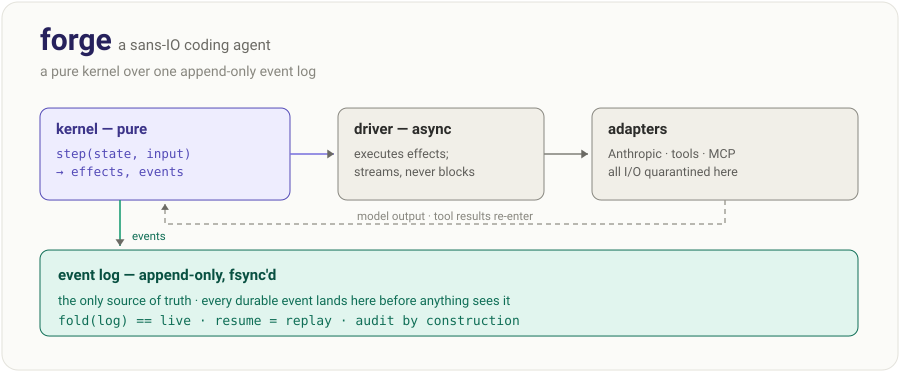

# forge



A coding-agent REPL built as a pure decision kernel over one append-only event
log. The kernel does no I/O; every model call, tool run, and permission verdict
is a replayable event. `fold(log) == live state`, so resume is just replay.

## Install & run

Requires Python ≥ 3.12 and [uv](https://docs.astral.sh/uv/).

```sh
uv tool install '.[mcp]'                # puts `forge` on your PATH
export ANTHROPIC_API_KEY=sk-...         # or CLAUDE_CODE_OAUTH_TOKEN
forge                                   # interactive REPL; /help lists commands
forge run -p "list the python files here" --json   # one shot; JSON record on stdout
```

No credentials? Smoke-test offline with the scripted provider:

```sh
forge run -p "hello" --provider fake --json
```

Default model is `claude-sonnet-4-6`; override with `--model <id>` or `FORGE_MODEL`.
In one-shot mode, put flags after `run` — flags before the subcommand are ignored.

Developing on the repo instead of installing? Use `uv run forge ...`.

## Sessions

Every turn is persisted as an event log under `~/.agent-forge/sessions/`.

```sh
forge sessions          # list this directory's sessions (id, age, first prompt)
forge --continue        # resume the most recent session here
forge --resume <id>     # resume a specific session
```

Resume restores the full conversation from the log, and a session killed
mid-turn is repaired on resume rather than left wedged.

## Add a tool

Write a class with a `spec` and an async `run`. Tools return error results, never raise.

```python
from forge.kernel.types import Effects, ToolResult, ToolSpec
from forge.ports.tool import ToolCtx

class WordCount:
    spec = ToolSpec(
        name="WordCount",
        description="Count words in a file.",
        params={"type": "object",
                "properties": {"path": {"type": "string", "format": "path"}},
                "required": ["path"]},
        effects=Effects.READ_PATH,
    )

    async def run(self, args, ctx: ToolCtx) -> ToolResult:
        text = ctx.ws.resolve(args["path"]).read_text()
        return ToolResult(call_id="", content=str(len(text.split())))
```

Wire it: add `WordCount()` to `builtin_tools()` in `forge/adapters/tools/__init__.py`.

The spec's `effects` and `format: "path"` annotations buy:

- containment — every path arg resolves inside the workspace before `run`; escapes are blocked
- scheduling — read-only calls run in parallel; `WRITE_PATH`/`EXEC`/`EXTERNAL` serialize
- guarding — `EXTERNAL` makes the permission chain Ask before the tool runs

## Connect an MCP server

```sh
uv tool install '.[mcp]'   # the mcp extra
```

Declare servers in `~/.agent-forge/mcp.toml` (global) or `./.agent-forge/mcp.toml`
(project — overrides global by server name):

```toml
[servers.fs]
command = "mcp-server-filesystem"
args    = ["/home/me/projects"]      # optional
env     = { GITHUB_TOKEN = "..." }   # optional
```

Or per invocation: `forge --mcp-server 'fs=mcp-server-filesystem /tmp'` (repeatable).
`--no-mcp` skips the TOML files. Server tools appear as `<server>__<tool>`; in the
REPL, `/mcp` shows status and `/mcp reconnect <name>` restores one. Tools a server
doesn't annotate are treated as `WRITE_PATH|EXEC|EXTERNAL`, so the guard Asks first.

## Develop

```sh
uv run pytest -q                              # full suite
uv run lint-imports                           # the layer law (2 contracts)
uv run python scripts/gen_concept_index.py    # regenerate docs/CONCEPTS.md after public-surface changes
```

The layer law is enforced, not aspirational: `kernel` imports nothing internal;
`ports`/`policy` import only `kernel`; `drive`/`adapters` sit above; `front` wires
it all. The kernel is pure and synchronous — asyncio lives only in `drive` and `adapters`.

## Pointers

- [DESIGN.md](DESIGN.md) — the architecture, decisions, and as-built notes
- [docs/CONCEPTS.md](docs/CONCEPTS.md) — generated index of every public symbol
- [eval/](eval/) — the benchmark harness and baselines (`forge run --json` is the contract)
- Event logs: `~/.agent-forge/sessions/<id>.jsonl` (override root with `FORGE_SESSIONS_ROOT`)
